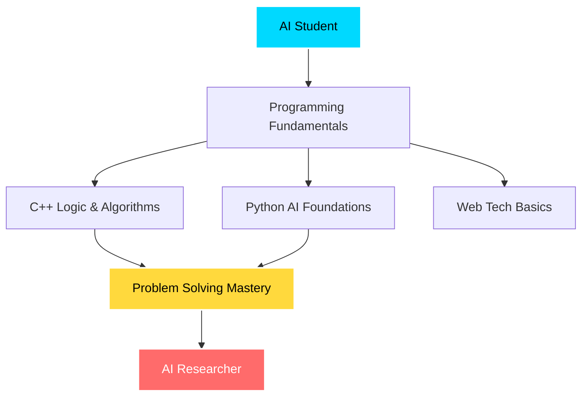

<div align="center">

<!-- Ultra Dynamic Animated Header -->


<!-- Glowing Name Animation -->
<h1 align="center">
  
</h1>

<!-- Multi-line Typing Animation -->
<p align="center">
  
</p>

<!-- Animated Divider -->


<!-- Animated Icons Row -->
<p align="center">
  
  
  
  
  
</p>

</div>

---

<div align="center">

<!-- Welcome Message with Animation -->


<br>

<!-- Dynamic Greeting Box -->
<table>
<tr>
<td>

###  **You've Discovered My AI Journey**


Welcome to my **digital learning space**!   

I'm **Abdul Rafhy**, and this isn't just another GitHub profile—it's a **living testament** to my journey in Artificial Intelligence. Every commit, every project, every line of code tells a story of growth, curiosity, and dedication.

 **What you'll find here:**
-  Projects built with **passion & purpose**
-  A **learning-first** approach to AI
-  **Research-oriented** mindset
-  Consistent growth over time

</td>
</tr>
</table>


</div>

---

<div align="center">

###  *"The question of whether a computer can think is no more interesting than the question of whether a submarine can swim."*
**— Edsger W. Dijkstra**

</div>


---

##  Who I Am

<div align="center">

<table>
<tr>
<td width="50%">


###  **My Core Beliefs**

```python
class AbdulRafhy:
    def __init__(self):
        self.role = "AI Student"
        self.goal = "AI Researcher"
        self.approach = "First Principles"
        
    def my_philosophy(self):
        return {
            "learning": "Deep over surface",
            "focus": "Fundamentals over shortcuts",
            "mindset": "Long-term thinking",
            "style": "Concept-first, tool-second",
            "motto": "Consistency beats motivation"
        }
```

</td>
<td width="50%">


###  **What Defines Me**

 **Deep understanding** beats surface-level knowledge

 **Fundamentals** matter more than shortcuts

 **Long-term thinking** creates real expertise

 **Concept-first**, tool-second approach

 **Consistency** over motivation

 **Process** over outcomes

</td>
</tr>
</table>

</div>


---

<div align="center">

##  My Current Learning Path


</div>

<br>

<table align="center">
<tr>
<td width="50%" valign="top">

###  **Academic Journey**



</td>
<td width="50%" valign="top">

###  **Present Focus**

 **Programming & Logic**  
Strengthening core programming skills

 **C++ Mastery**  
Logic, recursion & problem-solving

 **Python for AI**  
Building AI foundations

 **Web Fundamentals**  
HTML & CSS learning

 **Version Control**  
Professional Git & GitHub

</td>
</tr>
</table>


---

<div align="center">

###  *"Artificial intelligence is the new electricity."*
**— Andrew Ng**

</div>


---

<div align="center">

##  Tech Stack & Arsenal


</div>

<br>

<div align="center">

<!-- Animated Tech Icons -->
<p>
  
</p>

<!-- Detailed Skill Badges -->
<table>
<tr>
<td align="center" width="25%">
<br>
<b>C++</b><br>
<sub>Intermediate</sub><br>

</td>
<td align="center" width="25%">
<br>
<b>Python</b><br>
<sub>Intermediate</sub><br>

</td>
<td align="center" width="25%">
<br>
<b>HTML5</b><br>
<sub>Learning</sub><br>

</td>
<td align="center" width="25%">
<br>
<b>CSS3</b><br>
<sub>Beginner</sub><br>

</td>
</tr>
</table>

###  **AI & Conceptual Knowledge**


</div>


---

<div align="center">

##  GitHub Analytics


</div>

<br>

<div align="center">

<!-- Main Stats -->


</div>

<br>

<div align="center">

<!-- Languages & Activity -->


</div>

<br>

<div align="center">

<!-- Profile Views & Trophies -->


<br><br>

<!-- GitHub Trophies -->


</div>


---

<div align="center">

###  *"In God we trust. All others must bring data."*
**— W. Edwards Deming**

</div>


---

<div align="center">

##  Featured Projects


</div>

<br>

<div align="center">

<!-- Pinned Repos - Replace with your actual repository names -->
<a href="https://github.com/Rafhy-Khan/Students_grades_tracker">
  
</a>

<a href="https://github.com/Rafhy-Khan/Recursion-Program">
  
</a>

<br><br>


</div>


---

<div align="center">

##  Vision & Philosophy

</div>

<table align="center">
<tr>
<td width="50%" valign="top">

### 🔭 **Long-Term Vision**


**Become an AI Researcher** who:

 Understands intelligence from **first principles**

 Focuses on **mathematics, logic, data & ethics**

 Builds **systems**, not just applications

 Takes a **foundation-first** approach

 Thinks **long-term**, acts consistently

 Contributes to advancing AI understanding

</td>
<td width="50%" valign="top">

###  **Learning Philosophy**


My principles for growth:

 **Fundamentals** before complexity

 **Clarity** before speed

 **Depth** before visibility

 **Consistency** over motivation

 **Process** over outcomes

 **Growth** over perfection

</td>
</tr>
</table>

<div align="center">

###  *"We can only see a short distance ahead, but we can see plenty there that needs to be done."*
**— Alan Turing**

</div>


---

<div align="center">

##  Contribution Snake


</div>

<br>

<div align="center">

<!-- Snake Animation -->
<picture>
  <source media="(prefers-color-scheme: dark)" srcset="https://raw.githubusercontent.com/Rafhy-Khan/Rafhy-Khan/output/github-snake-dark.svg">
  <source media="(prefers-color-scheme: light)" srcset="https://raw.githubusercontent.com/Rafhy-Khan/Rafhy-Khan/output/github-snake.svg">
  
</picture>

</div>


---

<div align="center">

###  *"The science of today is the technology of tomorrow."*
**— Edward Teller**

</div>


---

<div align="center">

##  Core Values

</div>

<table align="center">
<tr>
<td align="center" width="33%">
<br>
<b>Honest Learning</b><br>
<sub>Over fake expertise</sub>
</td>
<td align="center" width="33%">
<br>
<b>Deep Fundamentals</b><br>
<sub>Over surface trends</sub>
</td>
<td align="center" width="33%">
<br>
<b>Ethical AI</b><br>
<sub>Always responsible</sub>
</td>
</tr>
<tr>
<td align="center" width="33%">
<br>
<b>Collaboration</b><br>
<sub>Over competition</sub>
</td>
<td align="center" width="33%">
<br>
<b>Growth Mindset</b><br>
<sub>Always learning</sub>
</td>
<td align="center" width="33%">
<br>
<b>Process Focus</b><br>
<sub>Respect the journey</sub>
</td>
</tr>
</table>


---

<div align="center">

##  Let's Connect & Collaborate


</div>

<br>

<table align="center">
<tr>
<td align="center" width="50%">


### ** I'm Seeking:**

 Mentorship from experienced AI practitioners  
 Meaningful collaborations on AI/ML projects  
 Learning partnerships for mutual growth  
 Feedback on code, approach & methodology  
 Open-source contribution opportunities

</td>
<td align="center" width="50%">


### ** What I Offer:**

 Genuine passion for learning  
 Strong work ethic & discipline  
 Critical thinking skills  
 Research-oriented mindset  
 Willingness to go the extra mile

</td>
</tr>
</table>

<div align="center">

###  **I believe in learning in public and building together!**

</div>


---

<div align="center">

###  *"Machine intelligence is the last invention that humanity will ever need to make."*
**— Nick Bostrom**

</div>


---

<div align="center">

##  Get in Touch


</div>

<br>

<div align="center">

<!-- Social Links with Icons -->
<a href="mailto:abdulrafhy852@gmail.com">
  
</a>
&nbsp;&nbsp;
<a href="https://github.com/Rafhy-Khan">
  
</a>
&nbsp;&nbsp;
<a href="https://linkedin.com/in/abdul-rafhy-0b373b333">
  
</a>

<br><br>

<!-- Contact Info -->
<table>
<tr>
<td align="center">
<br>
<b>Email</b><br>
<sub>abdulrafhy852@gmail.com</sub>
</td>
<td align="center">
<br>
<b>GitHub</b><br>
<sub>@Rafhy-Khan</sub>
</td>
<td align="center">
<br>
<b>LinkedIn</b><br>
<sub>Connect with me</sub>
</td>
</tr>
</table>

</div>


---

<div align="center">

<!-- Final Quote & Signature -->


<br>


<br>

**Thanks for visiting!  Let's shape the future of AI together! **

<br>

<sub>Last Updated: 2026 | Crafted with , dedication & passion for AI</sub>

<br><br>

<!-- Visitor Counter Animation -->


</div>
