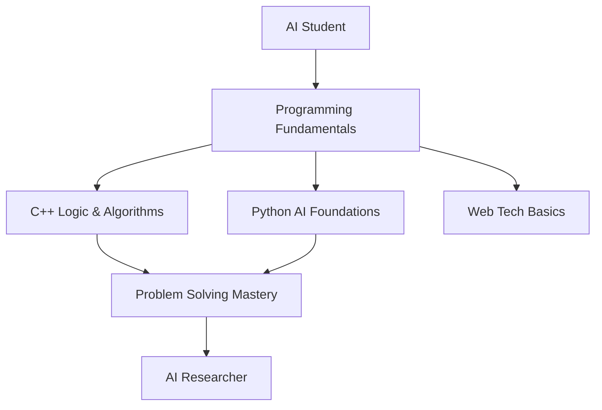

<div align="center">

<!-- Animated Header -->


<!-- Typing SVG -->
<a href="https://git.io/typing-svg"></a>

</div>

---

<div align="center">

###   *"The question of whether a computer can think is no more interesting than the question of whether a submarine can swim."* 
**— Edsger W. Dijkstra**

</div>

---

##  Welcome to My Learning Journey


Hello! I'm **Abdul Rafhy**, an undergraduate Artificial Intelligence student on a mission to understand intelligence from first principles. This GitHub profile is my **living laboratory** — a space that evolves with every concept I master, every line of code I write, and every problem I solve.

###  What Defines Me

-  **Deep understanding** beats surface-level knowledge
-  **Fundamentals matter** more than shortcuts  
-  **Long-term thinking** creates real expertise
-  **Concept-first**, tool-second approach
-  **Consistency** over motivation

<br clear="right"/>

---

<div align="center">

##  Current Focus & Learning Path

</div>

<table align="center">
<tr>
<td width="50%" valign="top">

###  Academic Journey


</td>
<td width="50%" valign="top">

###  Present State
- 🔹 Strengthening **programming & logical thinking**
- 🔹 Mastering **C++** for recursion & problem-solving
- 🔹 Building **Python** foundations for AI
- 🔹 Learning **HTML & CSS** fundamentals
- 🔹 Professional **Git & GitHub** version control
- 🔹 **Research-oriented mindset** from day one

</td>
</tr>
</table>

---

<div align="center">

###  *"Artificial intelligence is the new electricity."* 
**— Andrew Ng**

</div>

---

##  Tech Stack & Skills

<div align="center">

###  Programming Languages


<br><br>

###  Skill Levels


###  AI & Conceptual Knowledge


</div>

---

<div align="center">

##  GitHub Statistics & Contributions

</div>

<div align="center">

<!-- GitHub Stats Card -->


<!-- Streak Stats -->


</div>

<br>

<div align="center">

<!-- Language Stats -->


<!-- Activity Graph -->


</div>

<br>

<div align="center">

<!-- Profile Views Counter -->


<!-- GitHub Trophies -->


</div>

---

<div align="center">

### 🎓 *"In God we trust. All others must bring data."* 
**— W. Edwards Deming**

</div>

---

##  Featured Repositories

<div align="center">

<!-- Replace with your actual repository names -->
<a href="https://github.com/Rafhy-Khan/Students_grades_tracker">
  
</a>

<a href="https://github.com/Rafhy-Khan/Recursion-Program">
  
</a>

</div>

---

<div align="center">

##  Vision & Philosophy

</div>

<table align="center">
<tr>
<td width="50%" valign="top">

### 🔭 Long-Term Vision

**Become an AI Researcher** who:
-  Understands intelligence from **first principles**
-  Focuses on **mathematics, logic, data & ethics**
-  Builds **systems**, not just applications
-  Takes a **foundation-first** approach
-  Thinks **long-term**, acts consistently

</td>
<td width="50%" valign="top">

###  Learning Philosophy

-  **Fundamentals** before complexity
-  **Clarity** before speed
-  **Depth** before visibility
-  **Consistency** over motivation
-  **Process** over outcomes

</td>
</tr>
</table>

<div align="center">

###  *"We can only see a short distance ahead, but we can see plenty there that needs to be done."* 
**— Alan Turing**

</div>

---

##  Contribution Activity

<div align="center">

<!-- GitHub Contribution Snake -->
<picture>
  <source media="(prefers-color-scheme: dark)" srcset="https://raw.githubusercontent.com/Rafhy-Khan/Rafhy-Khan/output/github-contribution-grid-snake-dark.svg">
  <source media="(prefers-color-scheme: light)" srcset="https://raw.githubusercontent.com/Rafhy-Khan/Rafhy-Khan/output/github-contribution-grid-snake.svg">
  
</picture>


</div>

---

<div align="center">

###  *"The science of today is the technology of tomorrow."* 
**— Edward Teller**


</div>

---

##  Values & Growth Mindset

<div align="center">

```diff
+ Honest learning over fake expertise
+ Respect for the process
+ Deep fundamentals over surface trends
+ Ethical approach to AI development
+ Collaboration over competition
+ Growth mindset always
```

</div>

---

##  Open to Collaboration & Mentorship

<div align="center">

 **I'm actively seeking:**

-  **Mentorship** from experienced AI practitioners
-  **Meaningful collaborations** on AI/ML projects  
-  **Learning partnerships** for growth
-  **Feedback** on my code and approach
-  **Open-source contributions** opportunities

### I believe in **learning in public** and **building together**

</div>

---

<div align="center">

###  *"Machine intelligence is the last invention that humanity will ever need to make."* 
**— Nick Bostrom**

</div>

---

##  Let's Connect

<div align="center">

###  Reach Out

<a href="mailto:abdulrafhy852@gmail.com">
  
</a>

<a href="https://github.com/Rafhy-Khan">
  
</a>

<br><br>

** Email:** abdulrafhy852@gmail.com 
** GitHub:** [github.com/Rafhy-Khan](https://github.com/Rafhy-Khan)

---

###  *An AI student deliberately building strong foundations to grow into an AI researcher through deep learning and long-term thinking.*

---


<sub>Last Updated: 2025 | Built with  and dedication</sub>

</div>
